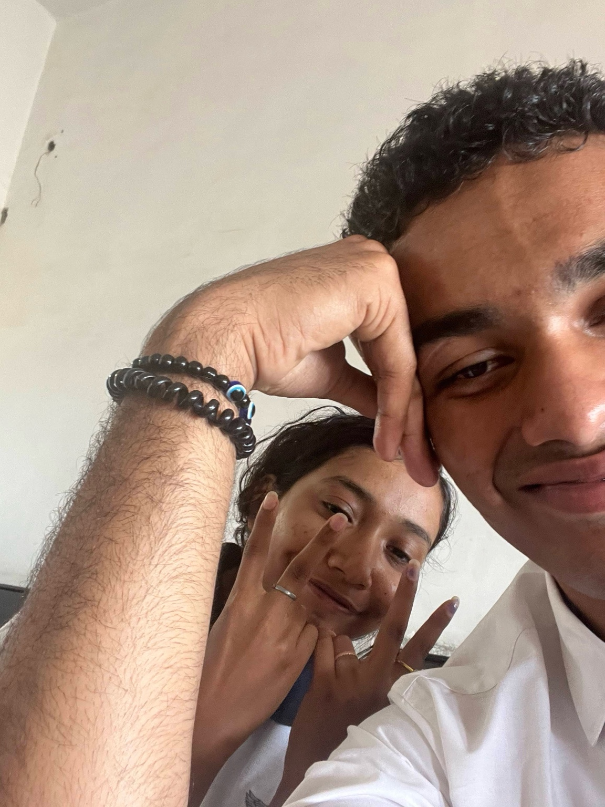

<!DOCTYPE html>
<html lang="en">
<head>
    <meta charset="UTF-8">
    <meta name="viewport" content="width=device-width, initial-scale=1.0">
    <title>Slideshow</title>
    
</head>
<body>
    

        

            
            
I’ll bury u in a bed full of flowers… yet, no matter how many flowers… you’re still much more prettier than any cosmos out there… (PS: ik they’re not cosmos but get the emotions””)

        

        

            
            
Our duo… is the perfect drama couple… koi bhi bakchodi, no one can do better than us… hehe

        

        

            
            
When u rocked the stage… cuz I drew the perfect eyeliner for my baby

        

        

            
            
With us… we don’t need location or any fancy place… we need us and Vento to call it a date…

        

        
Babe, I love you so much and do as much nakhre as u want, mei hai idhar sambhalne keliye… PS: This is my first time… so please don’t judge me love ❤️

    

    
    
</body>
</html>
